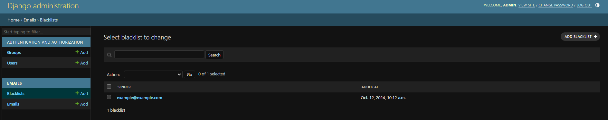

# Phishing Email Validator

## 📋 Overview
In this project, I have trained a machine learning model using a dataset named **"phishingemails"** from [Kaggle](https://www.kaggle.com/). The training method used was **n-gram**, which provided satisfying results, including **95% accuracy** and **0.0026 STD**. The dataset initially contained **175,088 records**, and I followed a series of steps to prepare and train the model effectively.

---

## 🔍 Steps Followed:
1. **Inspecting the Dataset:**
   - Identified useful features and handled missing (`NaN`) values effectively.
2. **Training the Model with n-gram:**
   - Researched and applied the **n-gram method** for training the model and evaluated performance.
3. **Evaluating the Model:**
   - Assessed key metrics such as **accuracy** and **standard deviation (STD)**.
4. **Cross-Validation:**
   - Used cross-validation to ensure the model performs consistently and avoids overfitting.
5. **Django API Development:**
   - Built an API using the **Django Web Framework** to serve the model's predictions.

---

## 📷 Visuals

### 1. Cross Validation Chart


### 2. Non Phishing Email


### 3. Phishing Email


### 4. Blacklisted Users


### 5. Emails Admin Page


---

## 🚀 How to Run the Project

Follow the steps below to set up and run the project on your local machine:

### 1. Clone the Repository
```bash
git clone <repository-url>
cd <repository-folder>
```
### 2. Install Requirements

```bash
pip install -r requirements.txt
```

### 3. Migration
```bash
python manage.py migrate
```

### 4. Run The Project
```bash
python manage.py runserver
```
